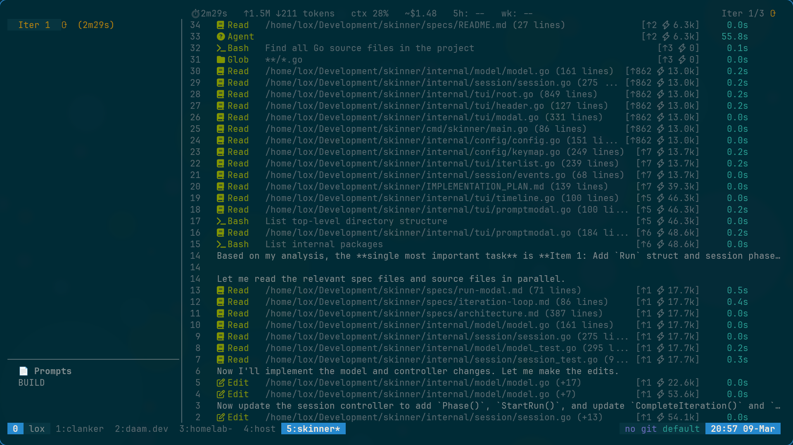

# skinner

Keeping an eye on [Ralph](https://ghuntley.com/ralph/).

A Go TUI that wraps Claude CLI and displays tool call activity in real time. I've been ralphing every day and wanted a better experience from my phone to observe what Claude is up to while it works.

This is hyper-personalised software — I built it for myself. You're welcome to use it, steal ideas from it, or build your own version.

> **Heads up:** This is under heavy development and may look completely different tomorrow.




## Install

```
go install github.com/loxstomper/skinner/cmd/skinner@latest
```

Or clone and build locally:

```
git clone https://github.com/loxstomper/skinner.git
cd skinner
make build    # builds ./skinner
make install  # installs to $GOPATH/bin
```

## Usage

```
skinner [--theme=<name>] [--exit] [build|plan] [max_iterations]
```

Skinner runs Claude CLI as a subprocess and renders a two-pane TUI — iterations on the left, tool call timeline on the right. Launch with `build` or `plan` to start immediately, or run without arguments to browse prompts and plans interactively. Press `?` for help.

| Flag | Description |
|------|-------------|
| `--theme=<name>` | Color theme: solarized-dark (default), solarized-light, monokai, nord |
| `--exit` | Exit automatically when iterations complete (useful for CI/scripting) |

## Features

- **Two-pane layout** — iterations on the left, tool call timeline on the right (auto-switches to bottom layout on narrow terminals)
- **Tool call groups** — consecutive same-type calls collapse into expandable groups with duration tracking
- **Vim navigation** — hjkl, count+motion, gg/G, relative line numbers (`#`), configurable keybindings
- **Mouse support** — scroll and click in both panes
- **File explorer** (`f`) — browse project files with syntax highlighting, fuzzy search, and git status
- **Git viewer** (`ctrl+g`) — commit history with side-by-side diffs
- **Tasks viewer** (`t`) — browse [beads](https://github.com/loxstomper/bd) issues with tree/flat modes, tab filtering, and fuzzy search
- **Plan mode** (`p`) — interactive Claude session for creating implementation plans
- **Plan & prompt pickers** — browse and select `*_PLAN.md` / `PROMPT_*.md` files
- **Run modal** — interactive iteration count prompt before starting a run
- **Themes** — solarized-dark (default), solarized-light, monokai, nord
- **System stats** — live CPU/memory in the header
- **Token tracking** — per-tool-call token attribution, context window %, session cost, rate limit windows
- **Duration tracking** — live elapsed time on tool calls, groups, and iterations
- **Path trimming** — auto-trims CWD and home directory from displayed file paths
- **Thinking indicator** — shows elapsed time while waiting for Claude's response
- **Quit confirmation** — prevents accidental exits; double ctrl+c to force quit
- **Scrollable detail** — expanded tool call content is independently scrollable

## Hooks

Hooks are user-defined shell commands that run at specific points in the iteration lifecycle.

| Hook | Type | When |
|------|------|------|
| `pre-iteration` | blocking | Before each iteration starts |
| `on-iteration-end` | fire-and-forget | After each iteration exits |
| `on-error` | fire-and-forget | After an iteration exits non-zero |
| `on-idle` | fire-and-forget | When the session becomes idle |

The `pre-iteration` hook communicates via JSON on stdout:

```json
{"prompt": "Fix the failing tests", "title": "Fixing tests"}
```

| Key | Description |
|-----|-------------|
| `prompt` | Replacement prompt for this iteration |
| `title` | Header text in the timeline pane |
| `done` | Stop the loop when `true` |

See [specs/hooks.md](specs/hooks.md) for the full contract.

## Configuration

Skinner reads TOML config from two locations:

| File | Scope |
|------|-------|
| `~/.config/skinner/config.toml` | Global defaults |
| `.skinner.toml` | Project-level overrides (in project root) |

```toml
theme = "nord"
view_mode = "compact"

[hooks]
pre-iteration = "./scripts/pre-iteration.sh"
on-idle = "./scripts/on-idle.sh"

[hooks.timeout]
pre-iteration = "60s"
```

See [specs/config.md](specs/config.md) for all options.

## Details

See [`specs/`](specs/) for design notes.

## License

MIT
